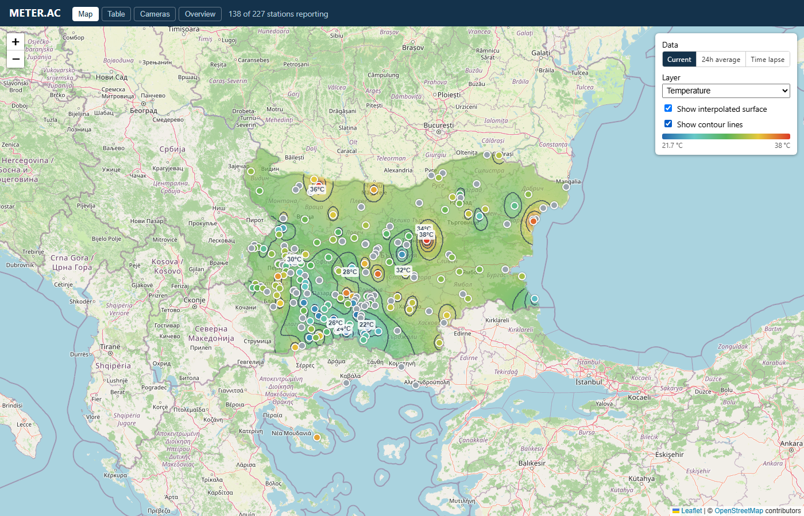

# my.meter.ac

A map-first web frontend for [METER.AC](https://meter.ac), an open atmospheric
monitoring network. This project is a proof of concept for a richer successor
to the legacy METER.AC interface: interactive maps, spatial interpolation,
time-lapse, calendar trends, and shareable station pages over the same public
data. The source is maintained at
[github.com/meter-ac/my.meter.ac](https://github.com/meter-ac/my.meter.ac).
See [AGENTS.md](./AGENTS.md) for the architecture and data-source reference.



## What's here

- **Map** — station markers colored by any parameter, an IDW-interpolated
  heatmap, isobar/isotherm contour lines, altitude-corrected temperature (DEM-
  based), Current/24h-average/Time-lapse modes. The time-lapse start time can
  be configured in Curator settings for historical playback.
- **Table** — sortable/filterable station lists across the Nodes, Meteo, and
  Earth (radon) networks, plus recent-earthquake and background-radiation
  reference tables.
- **Cameras** — snapshot gallery for camera-equipped stations.
- **Overview** — network snapshot (current extremes, reporting count) and a
  GitHub-style calendar heatmap of daily low/high, selectable by station,
  region, or the whole network.
- **Node pages** — a real, shareable page per station (`?node=ID`) with
  current readings, history chart, and camera, reachable from the map, the
  tables, or the camera gallery. Supports marking one station as a favorite
  (saved in the browser, no login) that becomes the default view.

## Development

Use the exact Node.js 24 release pinned by the digest-pinned `build` stage in
`Dockerfile` and the exact pnpm 11 release declared by `packageManager` in
`package.json`. Print the Node version expected by CI with
`scripts/ci/read-node-version.sh`:

```sh
scripts/ci/read-node-version.sh
pnpm install --frozen-lockfile
pnpm dev
```

No `.env`, no backend to run locally — the app talks directly to METER.AC's
existing public endpoints (a plain file server for station metadata/cameras,
a public read-only InfluxDB query API for readings) from the browser, in dev
and in production alike. The committed InfluxDB client credential is
intentionally public and read-only; public forks require no secrets.

### Development on Windows

The instructions above use `pnpm` and POSIX shell syntax. On Windows:

- **Prerequisites**: Node.js 24 (from [nodejs.org](https://nodejs.org/) or
  [winget](https://learn.microsoft.com/en-us/windows/package-manager/winget/))
  and pnpm 11. Install pnpm with `npm install -g pnpm@11` or enable Corepack
  with `corepack enable pnpm`.
- **PowerShell / Command Prompt** — the `scripts/ci/read-node-version.sh`
  helper requires a POSIX shell; instead just verify your Node version with
  `node -v`. The `pnpm` commands work as-is:
  ```powershell
  pnpm install --frozen-lockfile
  pnpm dev
  ```
- **Git Bash / WSL** — the POSIX instructions work unchanged if you're using
  Git Bash, WSL, or a similar environment.
- If you only have `npm` available, you can substitute `npx pnpm` for `pnpm`
  (e.g. `npx pnpm install --frozen-lockfile`).

### Tests

Install Chromium once on a fresh development machine, then run Playwright:

```sh
pnpm exec playwright install chromium
pnpm test
```

Use `--with-deps` when the host also needs Playwright's Linux system packages.
The suite builds fresh production assets, serves them with Vite preview at
`http://localhost:5173`, and exercises real METER.AC, InfluxDB, camera, and
map-tile services rather than mocks. Network access is required, and external
data availability can affect a run. CI retains the HTML report, traces, and
screenshots for seven days when the Playwright job fails.

Set `PLAYWRIGHT_BASE_URL` to test an already-running deployment without
starting Vite preview. For example, run the full suite against the production
container with `PLAYWRIGHT_BASE_URL=http://127.0.0.1:8080 pnpm test`.

### Continuous integration

GitHub Actions runs on pull requests targeting `master`, pushes to `master`,
and manual dispatches. The required `Playwright`, `Dependency review`, and
`Container` checks respectively exercise the production Vite build against the
live services, reject newly introduced high or critical vulnerabilities, and
lint the CI shell helpers before building and probing the hardened
`linux/amd64` image. Public forks need no secrets. Validation jobs have
read-only repository access. Fork and Dependabot pull requests perform that
single uncredentialed image build without publication. Trusted same-repository
pull requests publish public previews only after all required checks pass.
Manual workflow dispatches validate without publishing.

The pnpm store and Docker build cache are deliberately not persisted across CI
runs so untrusted pull-request cache contents cannot enter a later publication
job. Dependabot checks GitHub Actions, pnpm-managed npm dependencies, and Docker
bases weekly. Version updates wait for a three-day cooldown, while security
updates remain exempt, and every generated pull request must pass the same CI.

### External services

OpenStreetMap tiles use the current standard endpoint,
`https://tile.openstreetmap.org/{z}/{x}/{y}.png`, with visible attribution.
Browsers must send a valid origin Referer as required by the tile usage policy.
Do not replace it with the retired `a`/`b`/`c` hostnames or suppress the
Referer. Preserve normal browser caching and do not prefetch, bulk-download, or
otherwise bypass the tile service's caching controls.

## Deployment

The public production image is
`ghcr.io/meter-ac/my.meter.ac:latest` for `linux/amd64`. Each successful
`master` run also publishes a commit-addressed `sha-<full-commit>` tag. The
workflow generates a BuildKit SBOM and maximal provenance, signs the resulting
digest once with keyless Cosign through GitHub OIDC, verifies that signature,
and only then creates the commit tag and advances `latest`. Reruns reuse rather
than replace an existing commit tag, after confirming its revision and platform
metadata. The operations-owned production deployment tracks `latest` through
Watchtower; use a commit tag or digest for an immutable rollback reference.
Production is live at [my.meter.ac](https://my.meter.ac/).

Trusted same-repository pull requests publish mutable `pr-N` and commit-
addressed `pr-N-sha-<full-merge-commit>` preview tags. The mutable tag follows
new revisions of that pull request, while the commit-addressed tag pins one
tested merge revision and is never replaced by a rerun. Preview images
deliberately omit SBOM, provenance, and signatures. Fork and Dependabot pull
requests never publish images. Rerunning an older workflow cannot move `pr-N`
backward to an older PR head, and an older `master` run cannot move production
`latest` backward; rollback uses an explicit commit tag or digest.

Closing a trusted pull request runs cleanup for all of its tagged preview
versions. A container already running from that image can continue until it is
stopped, but the image cannot be pulled again or used to recreate the service.
Preview operators should therefore remove the corresponding service when
closing its pull request. If GitHub suppresses the close workflow for a
conflicted pull request or automatic cleanup otherwise needs recovery, dispatch
the `Cleanup PR images` workflow with any closed pull request number; repeating
cleanup is a safe no-op. The recovery path can also remove unexpected
historical tags for a fork, Dependabot, or non-`master` pull request even though
current CI never publishes those previews. Cleanup refuses to delete a version
that also carries an unrelated tag. GitHub prevents deletion of a public
package version after 5,000 downloads, in which case cleanup fails visibly and
requires GitHub Support.

Verify a production digest against this repository's `master` workflow with:

```sh
cosign verify \
  --certificate-identity https://github.com/meter-ac/my.meter.ac/.github/workflows/ci.yml@refs/heads/master \
  --certificate-oidc-issuer https://token.actions.githubusercontent.com \
  ghcr.io/meter-ac/my.meter.ac@sha256:DIGEST
```

The image uses a pinned Node 24 builder with the repository's exact pnpm
version and frozen lockfile, then a pinned, unprivileged nginx runtime serves
only the fresh Vite output on port 8080. Node, pnpm, source, tests, and
development dependencies are not copied into the runtime stage. Build and run
the same container locally with:

```sh
docker build --platform linux/amd64 -t my-meter-ac:local .
docker run --rm \
  --read-only \
  --tmpfs /tmp:rw,noexec,nosuid,nodev,size=16m \
  --cap-drop ALL \
  --security-opt no-new-privileges \
  -p 8080:8080 \
  my-meter-ac:local
```

Run the same deterministic runtime probes as CI with
`scripts/ci/validate-container.sh my-meter-ac:local linux/amd64`. Shell helpers
must pass `shellcheck scripts/ci/*.sh`. Local runtimes such as Podman that omit
Docker health status may set `ALLOW_HTTP_HEALTH_FALLBACK=true`; the fallback
checks `/healthz` directly instead of the image's own health check and is
therefore rejected whenever `CI=true`.

The health endpoint is `http://127.0.0.1:8080/healthz`. Production must retain
the read-only root and writable `/tmp` tmpfs contract shown above. CI validates
this image on every event before any eligible trusted publication job runs.

- **Navigation is query-string based.** `?node=N06` and `?view=table` remain
  requests for `/`. nginx deliberately has no SPA fallback; unknown paths and
  missing assets return 404.
- **Caching follows the build output.** `index.html`, `/healthz`, errors, legal
  artifacts, and future unhashed public files are not immutable. Vite-generated
  `/assets/*` filenames are content-hashed and receive one-year immutable
  caching.
- **External data remains browser-owned.** nginx does not proxy METER.AC,
  InfluxDB, cameras, or map tiles. Its CSP permits the required external
  origins, same-origin scripts, inline styles used by React and Leaflet, and
  generated data images. The origin-only referrer policy preserves the Referer
  required by OpenStreetMap.
- **Traefik owns TLS.** nginx serves plain HTTP internally. The image contains
  no certificates, HSTS policy, host routing, or authoritative Compose file.
- **No deployment configuration or secrets are built in.** The browser's
  existing InfluxDB credential remains deliberately public and read-only.
- **Legal artifacts ship with the application.** `/LICENSE.txt`, `/NOTICE.txt`,
  and `/THIRD_PARTY_NOTICES.txt` are included in the final image and use the
  non-immutable cache class. Runtime component terms are included in the
  third-party notices.

## License and security

Original repository code is licensed under the
[Apache License 2.0](./LICENSE). Third-party packages, inherited assets, map
tiles, and external data are not relicensed; see
[THIRD_PARTY_NOTICES.md](./THIRD_PARTY_NOTICES.md) and [NOTICE](./NOTICE).
METER.AC-owned raw measurements and statistics derived from them are dedicated
under CC0, while NIMH, NIGGG, EEA, OpenStreetMap, and other third-party data
remain subject to their source terms.

Report vulnerabilities through the process in [SECURITY.md](./SECURITY.md),
not a public issue.
